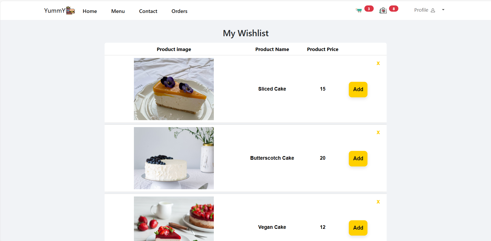
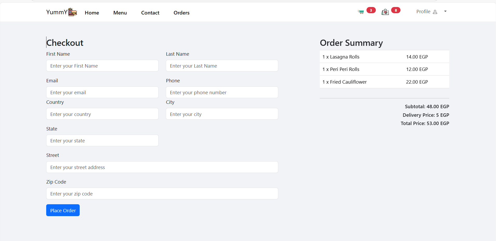
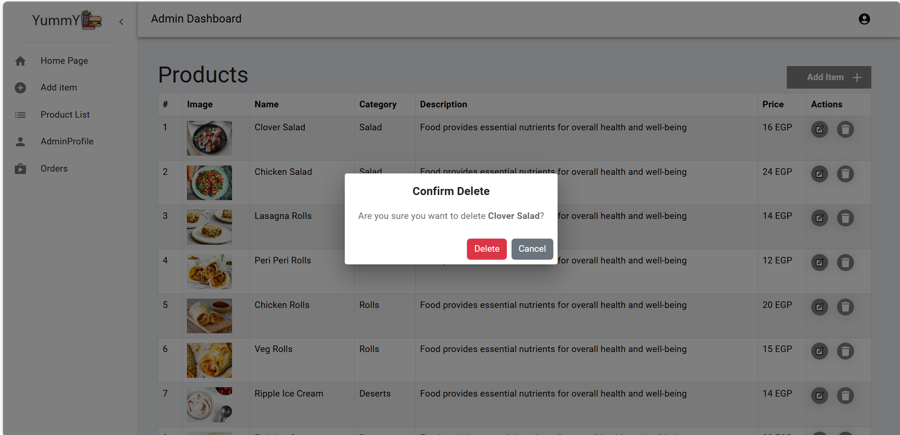
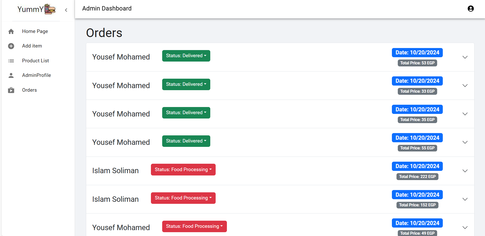
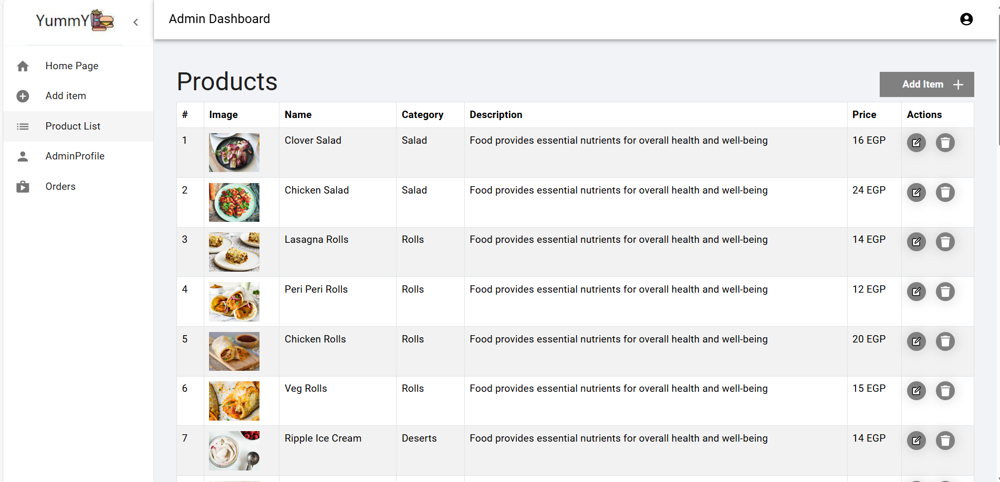

# Yummy - Restaurant App

## Introduction
**Yummy** is a modern, fully responsive restaurant web application that allows users to browse the menu, add meals to their cart, place orders, and make secure payments. The app features a robust admin dashboard for managing meals and orders. State management is handled with **Redux Toolkit** for efficient and scalable state handling.
## Hosting

You can access the live version of the project at the following URL:

[YummY Website](http://ec2-13-61-64-46.eu-north-1.compute.amazonaws.com:3000/)

## Features
### User:
- Browse the restaurant's menu with detailed descriptions and images of dishes.
- Add items to the cart, place orders, and pay online.
- Manage wishlists and view top-rated meals.
- Fully responsive design for mobile, tablet, and desktop.

### Admin:
- Create, update, and delete menu items.
- View, manage, and update customer orders.
- Full CRUD functionality for menu management.

### Payment:
- Integrated with a secure payment gateway (Stripe ).

### User Interface:


*Homepage showcasing the featured meals.*


*Wishlist page for saving favorite meals.*


*Menu showcasing the featured meals.*


*Cart displaying selected meals for checkout.*


*Order checkout page where users place and pay for their orders.*

### Admin Dashboard:

*Admin interface for removing menu items.*


*Admin interface for adding new menu items.*


*Admin interface for updating existing menu items.*


*Admin interface for managing customer orders.*


*Admin interface displaying the list of all products.*


## Tech Stack
### Frontend:
- **React.js**
- **React Bootstrap** (for UI components)
- **Material UI** (for enhanced UI)
- **Axios** (for API calls)
- **HTML5**, **CSS3**, **JavaScript (ES6)**

### Backend:
- **Node.js** (for backend logic)
- **Express.js** (for API development)
- **MongoDB (Mongoose)** (for database operations)
- **bcrypt**
- **stripe**
- **jsonwebtoken**

### State Management:
- **Redux Toolkit** (for global state management)
  - **useDispatch**: to dispatch actions to the Redux store.
  - **useSelector**: to select specific slices of state from the Redux store.
  - **Slices**: modular state management with slices (e.g., `cartSlice`, `itemSlice`, `orderSlice`).


## Installation

### Prerequisites
- Node.js installed on your system
- npm or yarn package manager

### Steps
1. Clone the repository:
   ```bash
   git clone https://github.com/shemaamohamed/restaurant-app.git
2. Navigate to the project directory:
       ```bash
           cd restaurant-app
3. Install the required dependencies:
       ```bash
           npm install

4. Start Frontend
        ```bash
           npm start 
5. Set up environment variables:
   Create a .env file in the root directory and add the necessary variables 
6. Start the development server
        ```bash
           cd backend
        ```bash
           node server 
## Contributing
If you would like to contribute to the project, feel free to:

1. **Fork the repository**: Create your own copy of the project on GitHub.
2. **Make your changes**: Implement your features or fix bugs.
3. **Submit a pull request**: Propose your changes to be merged into the main repository.


We appreciate your contributions and support in improving the Yummy Restaurant App!


       
       
            


